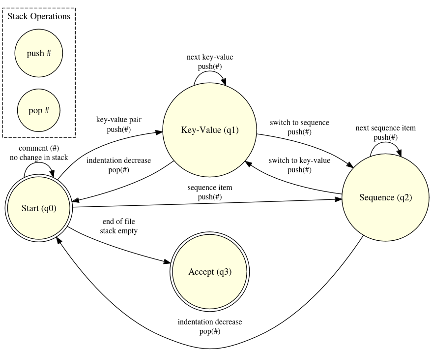

# recognize-yaml
A school project to recognize yaml files

# Grammaire

```
Document ::= (Directive? DocumentContent Comment?)*
Directive ::= '%' 'YAML' Version
Version ::= Digit '.' Digit
DocumentContent ::= BlockNode | FlowNode
BlockNode ::= BlockMap | BlockSequence
BlockMap ::= (Key Value Comment?)*
Key ::= Scalar
Value ::= Scalar | BlockNode | FlowNode
BlockSequence ::= ('-' Value Comment?)*
FlowNode ::= '{' (Pair (',' Pair)*)? '}' | '[' (Value (',' Value)*)? ']'
Pair ::= Key ':' Value Comment?
Comment ::= '#' .*  
```

# Automate

